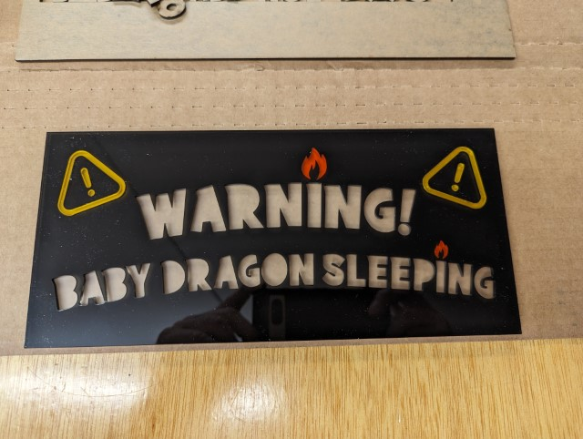

# Sleeping Dragon Sign Hardware Test

The Sleeping Dragon Sign project uses three strands of NeoPixels:

1. 2 NeoPixels for the Warning Symbols
2. 3 NeoPixels for the 'Warning' text
3. 5 NeoPixels for the 'Baby Dragon Sleeping' text

After I wired up the hardware, I had to have a little program I could use to make sure everything worked as expected, so I wrote this sketch. What it does it Illuminate each NeoPixel one by one, across each strand for the duration defined in `DELAY_VALUE`. 

I want the strands to behave differently, so this was the first time I ever worked with more than one FastLED LED array. 

